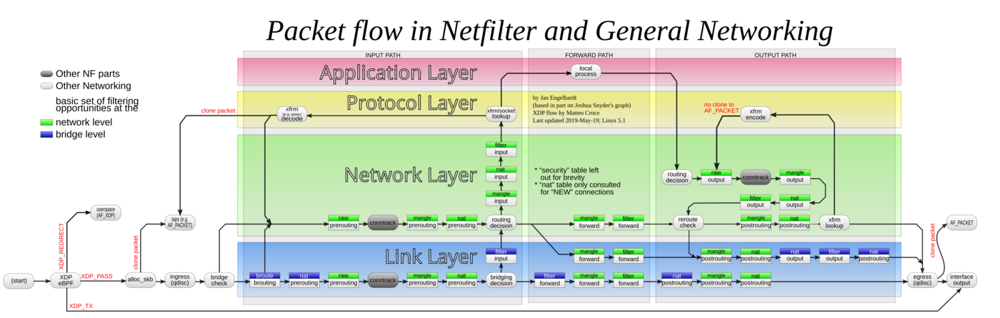

# ebpf-lab

A minimal, real, runnable eBPF program, explained from zero. If you've never
touched kernel-space code before, this doc is written for you: every piece of
jargon is defined the first time it shows up, in order, before it gets reused.

The demo itself: a small piece of code that runs *inside the Linux kernel*
and counts network packets by source IP address, plus a normal Go program
that reads those counts. That's it — small on purpose, so the mechanism is
visible instead of buried under features.

## 1. The problem, before the acronym

Every program you've ever written runs in **user space**: your own memory,
your own crash blast radius, and every time you need something the machine
itself controls — send a network packet, open a file, talk to a device —
you ask the kernel to do it for you through a **syscall** (system call). The
kernel is the one piece of software with full access to the hardware; your
program never touches the network card directly, it asks the kernel to.

That boundary is exactly why the kernel is normally *closed* to you. You
can't just drop a function into it and see what happens — if that function
has a bug, there's no safety net. A crash in the kernel isn't "your program
exits," it's the whole machine going down.

Historically, if you genuinely needed code running inside the kernel — to
inspect every packet at line rate, or watch every syscall a process makes,
without the overhead of asking the kernel a question every single time —
you had two bad options:

- **Write a kernel module** (a `.ko` file, loaded with `insmod`): real
  kernel code, full power, full risk. A bug is a kernel panic (the machine
  freezes/reboots) or, if it's a bug an attacker can trigger, a way to take
  over the box completely. It also has to be built against a specific
  kernel version, so it's fragile across upgrades.
- **Watch from the outside** with tools like `ptrace` (the mechanism behind
  `strace`): safe, because your watcher stays in user space, but it works by
  pausing the target process on every single event you're watching for, then
  resuming it once your watcher has looked. That stop-the-world-per-event
  cost is fine for debugging one process by hand; it's not something you can
  run permanently on every server watching every syscall.

**eBPF** (extended Berkeley Packet Filter — the name is a historical
leftover from when it only filtered packets; today it runs almost anywhere
in the kernel, not just networking) is a third option: your code actually
runs inside the kernel, at near-native speed, but the kernel refuses to load
it in the first place unless it can prove your code is safe. No panics, no
`insmod`, and — because the check happens automatically — no per-event
pause-and-resume cost either.

## 2. The vocabulary you need to read the rest of this doc

Five terms, defined once, used everywhere after this:

- **Hook (or attach point)** — a specific spot in the kernel where you're
  allowed to plug in a small program, and a specific *type of event* that
  triggers it. "Every time a packet arrives on this network card" is a hook.
  "Every time this particular kernel function is called" is a different
  hook. You don't get to run code just anywhere in the kernel — only at
  points the kernel exposes on purpose.
- **Bytecode** — the code you write for the kernel side (C, in this repo)
  isn't compiled directly to your CPU's real instructions. It's first
  compiled to eBPF's own simple instruction format
  (bytecode) — a deliberately small, easy-to-analyze instruction set. This
  is what actually gets handed to the kernel when you "load" a program.
- **The verifier** — the piece of the kernel that reads your bytecode
  *before* running a single instruction of it, walks through every possible
  path your code could take, and refuses to load it if it finds anything
  that could go wrong. Concretely, that means rejecting a program that has:
  a loop that might never end; a memory read past the end of a buffer; a
  variable read before it's ever been given a value; or a stack frame using
  more than a fixed budget of space. This is the actual safety mechanism —
  not "trust the programmer,"
  but "prove it, or it doesn't run." It's also why eBPF code can't do
  everything normal C can: no recursion, no unbounded loops, a hard cap on
  how much stack you get (512 bytes) — the verifier has to be *able* to
  prove your program terminates and stays in bounds, so anything it can't
  reason about gets rejected.
- **JIT (just-in-time compilation)** — once the verifier accepts your
  bytecode, the kernel translates it into your actual CPU's native machine
  instructions before running it. This is why eBPF isn't slow despite being
  "checked first": the checking happens once, at load time, and after that
  it runs as real compiled code, not as an interpreted script.
- **BPF map** — your eBPF code runs inside the kernel; your normal program
  (this repo's Go binary) runs in user space. They can't share memory
  directly. A map is a small key→value store, similar in spirit to a
  `dict`/`HashMap`, that both sides are allowed to read and write. It's the
  *only* channel between the two worlds: the kernel side writes into it, the
  user-space side reads from it (or the reverse). In this repo, the kernel
  side counts packets into a map; the Go program's whole job is reading that
  map back out.

That's the full mechanism: **hook → bytecode → verifier → JIT → running
code that talks to user space through a map.** Everything below is that
mechanism applied to one concrete example.

One more term you'll see mentioned but that this demo doesn't actually use:
**CO-RE** ("Compile Once – Run Everywhere"). It's the feature that lets one
compiled eBPF program run unmodified across different kernel versions,
by embedding extra type information (called **BTF**) that the kernel uses to
patch up memory-layout details at load time instead of at compile time.
Tools like Falco or Cilium rely on it heavily so they can ship one binary
instead of a build-per-kernel-version. This demo skips it because it only
touches two very old, very stable data structures (an Ethernet header and an
IP header) whose layout hasn't changed in decades — so there's nothing for
CO-RE to protect against here. Mentioned so the term isn't a mystery if you
go read Cilium's or Falco's code next; not needed to understand this repo.

## 3. What this demo's hook actually is

The hook this demo uses is called **XDP** (eXpress Data Path): "run my code
as early as possible when a packet arrives on this network card" — as close
to the hardware as the kernel lets you get, before routing decisions,
firewall rules, or **connection tracking** (the kernel's internal
bookkeeping of which packets belong to which ongoing connection, so it
doesn't have to re-evaluate every rule for every packet of the same
conversation) have touched the packet. That
"before anything else" positioning is XDP's whole reason to exist: it's the
cheapest possible place to make a decision about a packet (count it, drop
it, redirect it) because none of the normal networking machinery has run
yet.

Concretely, "normal networking machinery" means the pipeline below — this
is the same routing/firewall/connection-tracking machinery just mentioned,
laid out as a diagram. XDP (bottom left, `XDP eBPF`) runs before any of it:



*Diagram by Jan Engelhardt, [CC BY-SA 3.0](https://creativecommons.org/licenses/by-sa/3.0/deed.en),
via [Wikimedia Commons](https://commons.wikimedia.org/wiki/File:Netfilter-packet-flow.svg)
(XDP additions by Matteo Croce). Unmodified except resized.*

Full breakdown of what each part of that diagram does, in plain terms, with
examples: [docs/netfilter-packet-flow.md](docs/netfilter-packet-flow.md).

```
kernel                                       user space
┌───────────────────────────────┐            ┌──────────────────────┐
│ network card receives a packet│            │ cmd/xdpcount/main.go │
│   └─ XDP hook (bpf/xdpcount.c)│◄── attach ──┤   link.AttachXDP()   │
│        counts it into a map   │            │                       │
│   pkt_count (BPF map)         │◄── read ───┤   Map.Iterate()      │
└───────────────────────────────┘            └──────────────────────┘
```

The Go program's job is small and split cleanly from the kernel side: load
the compiled bytecode, attach it to a network interface, then every couple
of seconds read the map and print what's in it. All the actual packet
inspection happens on the kernel side, once per packet, without the Go
program being involved at all.

## Quickstart

Requires Linux and either the Nix flake devShell in this repo, or a manual
toolchain (clang that can target BPF, libbpf's headers, kernel headers).

```console
$ nix develop
$ go generate ./cmd/xdpcount   # recompiles bpf/xdpcount.c -> .o + Go bindings (only needed if you edit the .c)
$ go build ./...
$ sudo ./xdpcount -iface eth0  # see "why sudo" below
```

Why `sudo`: loading an eBPF program needs the `CAP_BPF` and `CAP_NET_ADMIN`
**capabilities**. Linux capabilities are a way to grant a process one
specific slice of what root can do (e.g. "load BPF programs," "administer
network interfaces") instead of all of it — but in practice, most setups
(including this demo) just run as root rather than granting those two
capabilities individually.

The generated `xdpcount_bpfel.go` / `xdpcount_bpfel.o` files (plus a second,
rarely-needed pair for a small family of CPU architectures — more on that in
section 4) are committed to the repo on purpose.
That means anyone cloning this repo can `go build` it with a stock Go
toolchain and no BPF compiler at all — you only need the Nix devShell
(clang/libbpf/kernel-headers) when you're editing the eBPF C source itself
and need to regenerate those files. That split — "build the normal Go
program" vs. "recompile the kernel-side program" — is the same one every
real eBPF-based Go project (Cilium, Tetragon, Hubble) makes.

## 4. Reading the actual code

This section walks through the real files in this repo, in the order
they'd actually execute, with the code inline. The source files carry the
same explanations as inline comments.

### 4.1 The map: where the kernel side and the Go side meet

`bpf/xdpcount.c` declares one BPF map — the shared key→value store from
section 2 — before it declares any actual logic:

```c
// LRU so a scan from an unrelated host can't grow this map without bound.
// Trade-off: once full, a new source IP evicts the least-recently-used
// entry, which can silently drop a counter you still cared about.
struct {
	__uint(type, BPF_MAP_TYPE_LRU_HASH);
	__uint(max_entries, 4096);
	__type(key, __u32);   // ip->saddr, raw network-byte-order bytes
	__type(value, __u64); // packet count
} pkt_count SEC(".maps");
```

Read this as: "a map named `pkt_count`, where each key is a 4-byte source
IP address and each value is an 8-byte counter, holding at most 4096
entries." `BPF_MAP_TYPE_LRU_HASH` (LRU = Least Recently Used) is the map
*kind*: a plain hash map with a fixed size starts silently **rejecting**
new keys once full, which means you'd stop seeing new source IPs the
moment the map fills up. This LRU variant instead **evicts** whichever
existing key has gone the longest without being touched, to make room —
keeping accepting new IPs forever, at the cost of possibly forgetting an
IP you still cared about. Neither behavior is "correct" in general; it's a
trade-off you pick deliberately when you define the map.

### 4.2 Reading the packet, byte by byte, with proof it's safe

A packet arriving on the wire is just a sequence of bytes. XDP hands your
program a `[data, data_end)` range and nothing more — no parsed "packet"
object — so the program has to read those bytes itself, in the same order
they'd actually appear: Ethernet addressing first, then IP addressing:

```c
SEC("xdp")
int xdp_count_pkts(struct xdp_md *ctx) {
	void *data_end = (void *)(long)ctx->data_end;
	void *data = (void *)(long)ctx->data;

	struct ethhdr *eth = data;
	if ((void *)(eth + 1) > data_end)
		return XDP_PASS;

	if (eth->h_proto != bpf_htons(ETH_P_IP))
		return XDP_PASS;

	struct iphdr *ip = (void *)(eth + 1);
	if ((void *)(ip + 1) > data_end)
		return XDP_PASS;

	__u32 src_ip = ip->saddr;
```

Line by line: `struct ethhdr *eth = data` treats the very first bytes of
the packet as an Ethernet header (source/destination hardware address,
plus a field saying what comes next). `struct iphdr *ip = (void *)(eth +
1)` then treats the bytes *right after* that header as an IP header —
`eth + 1` means "one whole `ethhdr` past `eth`," i.e. the first byte once
Ethernet addressing is done. `ip->saddr` is the field inside that IP
header holding the sender's address — the one thing this whole program
actually wants.

The two `if ((void *)(... + 1) > data_end) return XDP_PASS;` lines are not
optional style. A packet can legitimately be shorter than a full header
(truncated, malformed, or simply not an IP packet at all), and the
verifier (section 2) will not load a program that might read past the end
of a buffer — full stop. Skip either check, and the program is rejected at
load time, before it has processed a single real packet. `XDP_PASS` here
means "give up on this packet, let it continue up the stack unmodified" —
the same meaning it has at the very end of the function, just reached
early.

The `eth->h_proto != bpf_htons(ETH_P_IP)` check filters out anything that
isn't an IPv4 packet (ARP, IPv6, ...) before we try to read an IP header
out of it. `bpf_htons()` converts our comparison constant into the same
big-endian byte order the packet's own `h_proto` field is stored in (see
"byte order," end of this section) — converting the constant once is
cheaper than converting the packet's bytes.

### 4.3 Counting, and handing the packet back

```c
	__u64 *count = bpf_map_lookup_elem(&pkt_count, &src_ip);
	if (count) {
		__sync_fetch_and_add(count, 1);
	} else {
		__u64 init = 1;
		bpf_map_update_elem(&pkt_count, &src_ip, &init, BPF_ANY);
	}

	return XDP_PASS;
}
```

`bpf_map_lookup_elem` is a map read: "does `pkt_count` already have an
entry for this source IP?" If yes, `__sync_fetch_and_add` increments it in
place — atomically, because packets on different CPU cores can hit this
same line at the same time. If no, `bpf_map_update_elem` inserts a fresh
entry starting at 1. Either way, the function ends with `XDP_PASS`: this
program only ever observes traffic, it never drops or redirects it (XDP
supports return codes that do — `XDP_DROP`, `XDP_TX`, `XDP_REDIRECT` — but
using them is a different demo).

One thing worth knowing before you benchmark this: the "before the kernel
even builds its normal packet representation" performance story from
section 3 only holds in **native mode**, where the network card's own
driver calls directly into the XDP hook. Not every driver supports that;
if yours doesn't, the kernel silently falls back to **generic mode**,
running this exact same program correctly, just later in the pipeline,
after that normal representation has already been built — same result,
none of the speed advantage. Check which mode you actually got with
`ip -d link show dev <iface>` (look for `xdp` vs `xdpgeneric` in the
output).

### 4.4 The Go side: load, attach, read

`cmd/xdpcount/main.go` is the user-space half. The two lines that matter
most are the load and the attach:

```go
objs := xdpcountObjects{}
if err := loadXdpcountObjects(&objs, nil); err != nil {
	log.Fatalf("loading BPF objects: %v", err)
}
defer objs.Close()

l, err := link.AttachXDP(link.XDPOptions{
	Program:   objs.XdpCountPkts,
	Interface: iface.Index,
})
```

`loadXdpcountObjects` comes from a *generated* file (`xdpcount_bpfel.go`,
produced by `go generate`, mentioned in the Quickstart above) — this is
the moment the compiled bytecode from section 4.1–4.3 is actually handed
to the kernel and run through the verifier. If it survives, `objs` now
holds live handles to the program (`XdpCountPkts`) and the map
(`PktCount`) declared in the C file. `link.AttachXDP` is the attach step:
from this call onward, every packet arriving on the chosen interface runs
`xdp_count_pkts()` in the kernel.

From there, the rest of `main.go` is a plain Go loop: every couple of
seconds (configurable with `-interval`), read every entry currently in
`pkt_count` and print it, until Ctrl-C:

```go
it := m.Iterate()
for it.Next(&key, &count) {
	binary.LittleEndian.PutUint32(addr, key)
	log.Printf("%-15s %d packets", addr.String(), count)
}
```

**Byte order**, the subtlety in that last line: it's the order a
multi-byte number's bytes are arranged in — "most significant byte first"
is called **big-endian**, "least significant byte first" is called
**little-endian**. An IP address on the wire is always stored in what's
called **network byte order**, which is big-endian, regardless of what CPU
sent or receives it — this is what `ip->saddr` in section 4.2 actually
contains. The Go code above takes those same 4 raw bytes (copied verbatim
into the map's `uint32` key) and writes them back out with
`binary.LittleEndian` to print them as an address again. That round-trip
only reproduces the original bytes correctly on a little-endian machine —
the byte order essentially every modern CPU (x86_64, ARM64) actually uses
— so the printed addresses would come out wrong on the handful of
big-endian architectures still in use (like IBM's s390x, which is also why
a separate `_bpfeb`, "BPF big-endian," build of the compiled program
exists, mentioned in the Quickstart above). A detail that's invisible
until someone runs this somewhere unusual.

## 5. eBPF next to the tools you might already reach for

Now that the vocabulary from section 2 exists, here's how eBPF actually
compares to the other ways of doing similar things — not as a scored table,
but as "what's this other tool, and where does it actually win or lose."

**iptables / nftables.** These are Linux's built-in packet-filtering tools:
you write *rules* ("if the destination is this address, do that"), and the
kernel walks that rule list for every packet. That list-walking is the
catch: with a handful of rules it's instant, but Kubernetes clusters can
easily generate thousands of rules (one set per Service), and a plain list
walk gets slower as the list grows. `kube-proxy` has a second mode called
**IPVS** (IP Virtual Server, a different built-in Linux load-balancing
mechanism) that already fixes the raw lookup-speed problem with a hash
table instead of a list — no eBPF needed for that part. Cilium's
eBPF-based replacement wins somewhere else: it can decide where a
connection should go *before* a packet is even built, so there's no
address-translation step to reverse later, and it supports programmable
policy logic instead of a fixed rule grammar — both things a rule list,
however fast, structurally can't do.

**A kernel module.** Covered in section 1 — full access to the kernel, and
full responsibility for not crashing it. eBPF exists specifically to get
most of what a kernel module gives you (code running in the kernel) without
that risk, at the cost of the verifier's restrictions (no recursion, no
unbounded loops, limited stack). If what you're building genuinely needs
those things — real recursive data structures, arbitrary instruction
sequences — a kernel module is still sometimes the only option; you're just
accepting "one bug away from a kernel panic" as the price.

**`ptrace`/`strace`, and tools like SystemTap.** `strace` uses `ptrace` to
pause a process on every syscall, inspect it, and resume it — safe (it
never touches the kernel itself) but too slow to run permanently on every
process on every server, which is exactly the gap eBPF-based tracing fills.
SystemTap takes the opposite trade-off: it compiles your tracing script
into an actual kernel module at run time, so it's fast but carries the same
crash risk as any hand-written module — there's no verifier checking a
SystemTap script before it runs.

**DPDK.** A completely different strategy: skip the kernel's networking
code entirely and let a user-space program talk to the network card
directly. This gets you the highest possible raw packet throughput, because
there's no kernel involved at all on the hot path — but it also means that
network interface is no longer usable for normal networking on that
machine at the same time, and it needs dedicated CPU cores spinning in a
tight polling loop rather than being woken up by an interrupt. XDP (this
demo's hook) gets close to DPDK's speed for a lot of workloads while the
machine keeps working normally otherwise — that's the trade Cilium and
Katran (below) make.

**A sidecar proxy** (the Envoy-style pattern behind most service meshes):
instead of touching the kernel at all, you run a small proxy process next
to each of your application's instances and route traffic through it. This
is the right tool when what you actually need is *application-layer*
awareness — reading an HTTP path, retrying a failed gRPC call, negotiating
TLS — because that kind of parsing is exactly what the verifier's
"prove it terminates and stays in bounds" rule makes painful to do safely
inside the kernel. The cost is an extra network hop and an extra running
process per instance. This is why even Cilium's own service-mesh mode
keeps a proxy around for that application-layer slice of the work, while
pushing everything below it (routing, load-balancing) into eBPF.

## 6. Why this has taken over so much infrastructure since ~2018

Four real, shipping examples, each solving the "used to need a kernel
module or a slow workaround" problem from above:

- **Cilium**, a Kubernetes networking plugin, replaces the iptables/IPVS
  datapath with eBPF: Service traffic is resolved through a hash-table
  lookup, and a hook on the socket's `connect()` call lets it pick the
  final destination *before* a packet is even built, skipping the whole
  address-translation dance entirely for pod-to-Service traffic.
- **Falco**, a runtime security tool, watches every syscall on every node
  to detect suspicious behavior (a shell spawned inside a container,
  unexpected file access, ...). It moved from a custom kernel module to an
  eBPF probe for the same reason `strace`-style tracing doesn't scale to
  "always on, every node": a verifier-checked probe that structurally can't
  panic the machine is the difference between a tool ops teams trust
  running everywhere, and one they disable.
- **Katran** (built by Meta) is a layer-4 load balancer built entirely as
  an XDP program: it makes the "which backend should this connection go
  to" decision at the earliest possible point in the network stack (section
  3), which is how it forwards millions of connections per box at a CPU
  cost a normal kernel-stack-based load balancer can't match.
- **Continuous profilers** (Parca, and similar tooling from Grafana) attach
  eBPF programs to a periodic timer to sample what every process on a
  machine is doing, fleet-wide, without restarting or recompiling a single
  one of those processes. The alternative — attaching a profiler to each
  process individually — doesn't scale once you have many services written
  in different languages.

## 7. Where this is headed

- **`sched_ext`** (merged into the mainline kernel in version 6.12) extends
  the same idea to the **scheduler** — the part of the kernel that decides
  which process gets to run on the CPU next. You can now write and hot-swap
  a custom scheduling policy as a verified eBPF program, no kernel rebuild
  or reboot required, for a subsystem that used to be effectively
  off-limits outside kernel development.
- **eBPF for Windows** (a Microsoft project) is *not* Linux's eBPF ported
  into the Windows kernel — it's a different execution engine (a userspace
  VM called uBPF, plus a separate verifier called PREVAIL) running inside a
  Windows driver, exposing the same style of tools and APIs on top. Worth
  knowing so you don't assume "eBPF" carries identical guarantees on both
  operating systems.
- The interesting long-term comparison to watch is eBPF against **WebAssembly
  (WASM)** as a general "safely run someone else's code" model — WASM is
  already used for browser and proxy plugins (Envoy supports WASM filters)
  and has a more general-purpose toolchain, while eBPF's advantage is being
  wired directly into kernel-level hook points with a decade of verifier
  hardening behind it. The likely outcome is both keeping their own lane
  (eBPF close to the kernel/network fast path, WASM in proxies and
  application-level plugins) rather than one replacing the other.

## 8. When *not* to reach for eBPF

- **You need application-layer logic** (parsing HTTP, gRPC, retry policies,
  ...). The verifier's entire design is "prove this terminates and touches
  only what it's allowed to," which is fundamentally at odds with parsing
  variable-length, stateful protocols. Even Cilium leans on a normal
  userspace proxy for that slice of the work (section 5).
- **Your logic doesn't fit inside what the verifier can prove safe.** No
  recursion, a 512-byte stack limit, and loops must be provably bounded.
  If what you're building genuinely needs recursion or open-ended data
  structures, you're fighting the tool, not using it.
- **You're targeting very old kernels, or a non-Linux system.** CO-RE
  (section 2) needs a kernel built with BTF support; in practice, treat
  "kernel 5.8 or newer" as the realistic floor if you don't want to
  hand-maintain a build per kernel version. There's no true in-kernel eBPF
  on Windows or macOS (see the eBPF for Windows note above).
- **You're relying on eBPF as a hard security boundary for untrusted
  users.** It was pitched for years as safe enough that any user could load
  their own eBPF programs — the security track record has walked that back.
  A real example: in 2021, a bug in how the verifier tracked value ranges
  through bitwise operations (CVE-2021-3490) let an unprivileged local user
  turn a crafted eBPF program into out-of-bounds kernel memory access, and
  from there full control of the machine. That and similar bugs are why
  most distributions now disable unprivileged eBPF loading by default —
  loading a program requires elevated privileges (the same `CAP_BPF` this
  demo needs), not "any logged-in user." If your threat model includes
  untrusted users on the box, the verifier is not the sandbox boundary to
  rely on.

## 9. Check your understanding

[docs/exercises.md](docs/exercises.md) has five small exercises against
this repo's actual code and the Netfilter doc from section 3 — each with a
collapsible hint and a collapsible solution, so you can try before you
peek. Not graded, just a way to catch it yourself if something didn't
actually stick.

## Sources

- [BPF Design Q&A — kernel docs](https://docs.kernel.org/bpf/bpf_design_QA.html)
- [Complexity of the BPF Verifier — pchaigno](https://pchaigno.github.io/ebpf/2019/07/02/bpf-verifier-complexity.html)
- [Kubernetes Without kube-proxy — Cilium docs](https://docs.cilium.io/en/stable/network/kubernetes/kubeproxy-free/)
- [Open-sourcing Katran — Meta Engineering](https://engineering.fb.com/2018/05/22/open-source/open-sourcing-katran-a-scalable-network-load-balancer/)
- [Tracing System Calls Using eBPF — Falco blog](https://falco.org/blog/tracing-syscalls-using-ebpf-part-1/)
- [Falco kernel event sources docs](https://falco.org/docs/concepts/event-sources/kernel/)
- [Sched_ext Merged For Linux 6.12 — Phoronix](https://www.phoronix.com/news/Linux-6.12-Lands-sched-ext)
- [eBPF for Windows — Microsoft](https://microsoft.github.io/ebpf-for-windows/)
- [CVE-2021-3490 — GitHub Advisory Database](https://github.com/advisories/GHSA-9wfm-q59x-qc3x)
- [Unprivileged eBPF disabled by default — Ubuntu Discourse](https://discourse.ubuntu.com/t/unprivileged-ebpf-disabled-by-default-for-ubuntu-20-04-lts-18-04-lts-16-04-esm/27047)
